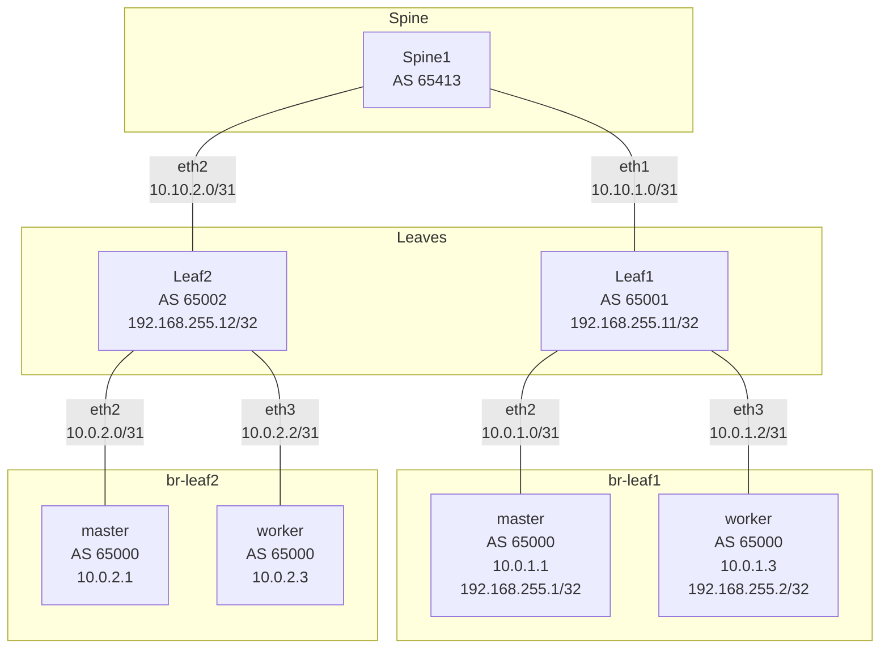

# BGP (CLOS fabric)

CLOS-style spine/leaf lab with eBGP. BGP sessions run **over loopbacks** (with a
static-route bootstrap) so BFD works correctly. The cluster's primary (machine)
network remains a flat L2; all BGP peering uses a separate secondary interface
per node.

## Overview

- **Spine1** (AS 65413) and **Leaf1** (AS 65001) / **Leaf2** (AS 65002) form the
  core. Each cluster node is **multi-homed** to both leaves via P2P /31 links.
- **Cluster** uses a single AS (65000). Each node peers with both leaves;
  sessions are **loopback-to-loopback** (eBGP multihop) so BFD is bound to a
  stable endpoint.
- **Bootstrap**: Static routes on both sides make the remote loopbacks reachable
  before BGP starts, avoiding a chicken-and-egg. NNCP adds OCP loopbacks, P2P
  addresses, and routes to the leaf loopbacks; leaf FRR configs add routes to
  OCP loopbacks.

### Topology



### Addressing

| Segment | Subnet | Purpose |
|---------|--------|--------|
| Spine1–Leaf1 | 10.10.1.0/31 | Core eBGP |
| Spine1–Leaf2 | 10.10.2.0/31 | Core eBGP |
| Leaf1–master / Leaf1–worker | 10.0.1.0/31, 10.0.1.2/31 | P2P + next-hop for static to OCP loopbacks |
| Leaf2–master / Leaf2–worker | 10.0.2.0/31, 10.0.2.2/31 | P2P + next-hop for static to OCP loopbacks |
| OCP loopbacks (NNCP) | 192.168.255.1/32, 192.168.255.2/32 | BGP session endpoint + router-id |
| Leaf loopbacks (FRR) | 192.168.255.11/32, 192.168.255.12/32 | BGP session endpoint + router-id |

### BGP

| Speaker | ASN | Peers (loopback) |
|---------|-----|------------------|
| Spine1 | 65413 | Leaf1 10.10.1.1, Leaf2 10.10.2.1 (P2P) |
| Leaf1 | 65001 | Spine1 10.10.1.0; OCP 192.168.255.1, 192.168.255.2 (multihop, BFD) |
| Leaf2 | 65002 | Spine1 10.10.2.0; OCP 192.168.255.1, 192.168.255.2 (multihop, BFD) |
| Cluster (FRR-K8s) | 65000 | Leaf1 192.168.255.11, Leaf2 192.168.255.12 (multihop, BFD) |

---

## Day 1: Deploy

### 1. Deploy the cluster and containerlab topology

From the `labs/02-bgp` directory:

=== "Kubernetes"

    ```bash
    CLUSTER_TYPE=k8s ./lab.sh up
    ```

The script will:

- Create the `br-leaf1` and `br-leaf2` bridges
- Deploy the containerlab topology (spine1, leaf1, leaf2)
- Provision a 2-node cluster via kcli (1 control plane + 1 worker)

Set your kubeconfig:

```bash
export KUBECONFIG=$HOME/.kcli/clusters/bgp/auth/kubeconfig
```

### 2. Install platform components

Install in order. Use the tab matching your cluster type.

=== "OpenShift"

    ```bash
    ./lab.sh up
    ```

--8<-- "install-ovn-kubernetes.md"

#### Enable network features

=== "Kubernetes"

    These features were configured at OVN-Kubernetes install time. Nothing to
    do here.

=== "OpenShift"

    Patch the Cluster Network Operator to enable FRR, `routingViaHost`,
    `ipForwarding`, and `routeAdvertisements`:

    ```bash
    kubectl patch network.operator.openshift.io cluster --type=merge \
      --patch '{
        "spec": {
          "defaultNetwork": {
            "ovnKubernetesConfig": {
              "routingViaHost": true,
              "ipForwarding": "Always",
              "routeAdvertisements": "Enabled"
            }
          },
          "additionalNetworks": [],
          "useMultiNetworkPolicy": true
        }
      }'
    ```

    Wait for the cluster network operator to roll out:

    ```bash
    kubectl rollout status daemonset -n openshift-ovn-kubernetes ovnkube-node --timeout=600s
    ```

--8<-- "install-nmstate.md"

#### Install MetalLB / FRR-K8s

=== "Kubernetes"

    Install MetalLB with FRR-K8s mode via Helm:

    ```bash
    helm repo add metallb https://metallb.github.io/metallb
    helm repo update
    kubectl create namespace metallb-system || true
    helm install metallb metallb/metallb -n metallb-system \
      --set frrk8s.enabled=true
    kubectl rollout status deployment -n metallb-system metallb-controller --timeout=300s
    ```

---

## Day 2: Configure & Validate

### Apply networking configuration

Use `kubectl` (or `oc` on OpenShift).

#### 1. Apply the NNCPs (loopback + P2P /31 + static routes)

The NNCP adds a BGP loopback (`lo-bgp`), P2P addresses on ens4/ens5, and static
routes to the leaf loopbacks so BGP can establish to 192.168.255.11 and
192.168.255.12 before any BGP session is up.

!!! warning "Apply NNCPs before FRRConfiguration"
    The static routes to the leaf loopbacks must exist on the nodes before
    FRR-K8s tries to peer. Apply the NNCPs first and wait for enactments to
    become `Available`.

```bash
kubectl apply -f config/01-nncps.yaml
```

Watch for all enactments to become `Available`:

```bash
kubectl get nnce -w
```

#### 2. Apply the FRRConfiguration

This configures BGP to the **leaf loopbacks** (192.168.255.11, 192.168.255.12)
with ebgpMultiHop and BFD.

!!! note "Namespace on vanilla Kubernetes"
    The manifest uses `namespace: openshift-frr-k8s`. On vanilla Kubernetes,
    change it to the namespace where FRR-K8s is installed (e.g. `metallb-system`)
    or create the FRRConfiguration in that namespace.

```bash
kubectl apply -f config/03-frrconfiguration.yaml
```

#### 3. Apply RouteAdvertisements

This enables advertisement of the default pod network (PodNetwork) to the leaves.

```bash
kubectl apply -f config/04-route-advertisements.yaml
```

---

### Validate

#### Check NNCPs

```bash
kubectl get nncp
kubectl get nnce
```

All enactments should show `Available`.

#### Check BGP sessions (cluster side)

=== "OpenShift"

    FRR-K8s is enabled via the Cluster Network Operator (handled by the patch
    above). No separate install needed.

=== "Kubernetes"

    ```bash
    FRR_POD=$(kubectl get pods -n metallb-system -l component=speaker -o name | head -1)
    kubectl exec -n metallb-system "$FRR_POD" -c frr -- \
      vtysh -c "show ip bgp summary"
    ```

You should see two neighbors (192.168.255.11 and 192.168.255.12) in state
Established.

#### Check BFD (cluster side)

=== "OpenShift"

    ```bash
    FRR_POD=$(oc get pods -n openshift-frr-k8s -o name | head -1)
    oc exec -n openshift-frr-k8s "$FRR_POD" -c frr -- \
      vtysh -c "show ip bgp summary"
    ```

=== "Kubernetes"

    ```bash
    kubectl exec -n metallb-system "$FRR_POD" -c frr -- \
      vtysh -c "show bfd peers"
    ```

BFD sessions to the leaf loopbacks should be Up.

#### Check BGP from a leaf

```bash
docker exec clab-bgp-leaf1 vtysh -c "show ip bgp summary"
```

You should see neighbors 192.168.255.1 and 192.168.255.2 (OCP) and 10.10.1.0
(Spine1) in Established.

#### Check BFD from a leaf

```bash
docker exec clab-bgp-leaf1 vtysh -c "show bfd peers"
```

#### Verify pod network is advertised

From spine1:

```bash
docker exec clab-bgp-spine1 vtysh -c "show ip bgp"
```

You should see the cluster's pod CIDR (e.g. 10.128.0.0/14 or similar) learned
via the leaves.

---

## Demonstrations

### BFD failure detection

Sessions run over loopbacks with BFD. To see BFD in action:

1. From a cluster node, you can temporarily break the path to one leaf
   loopback (e.g. remove the static route or shut the P2P interface). BFD
   should detect the failure and the BGP session to that leaf will drop.
2. Restore the path and confirm the session and BFD come back up.

### AS-path prepending

To influence path selection upstream (e.g. make the spine prefer one leaf over
another for the pod network), you can prepend the cluster AS (65000) on
advertisements. The exact mechanism depends on FRR-K8s and RouteAdvertisements
support for route policies. If the CRD does not support it, you can document
manual FRR route-map on the cluster or leaf side (e.g. on Leaf1/Leaf2, use a
route-map that prepends 65000 before advertising to Spine1). Verification:
from spine1, `show ip bgp` and check the AS path for the pod network prefix.

---

## Teardown

From the `labs/02-bgp` directory:

=== "OpenShift"

    ```bash
    oc exec -n openshift-frr-k8s "$FRR_POD" -c frr -- \
      vtysh -c "show bfd peers"
    ```

=== "Kubernetes"

    ```bash
    CLUSTER_TYPE=k8s ./lab.sh down
    ```

This will destroy the containerlab topology, delete the kcli cluster, and
remove the `br-leaf1` and `br-leaf2` bridges.

=== "OpenShift"

    ```bash
    ./lab.sh down
    ```
