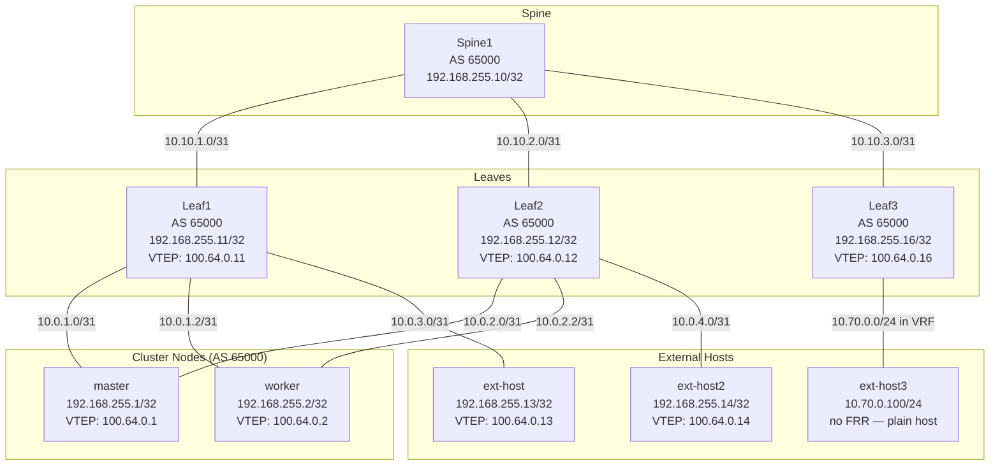
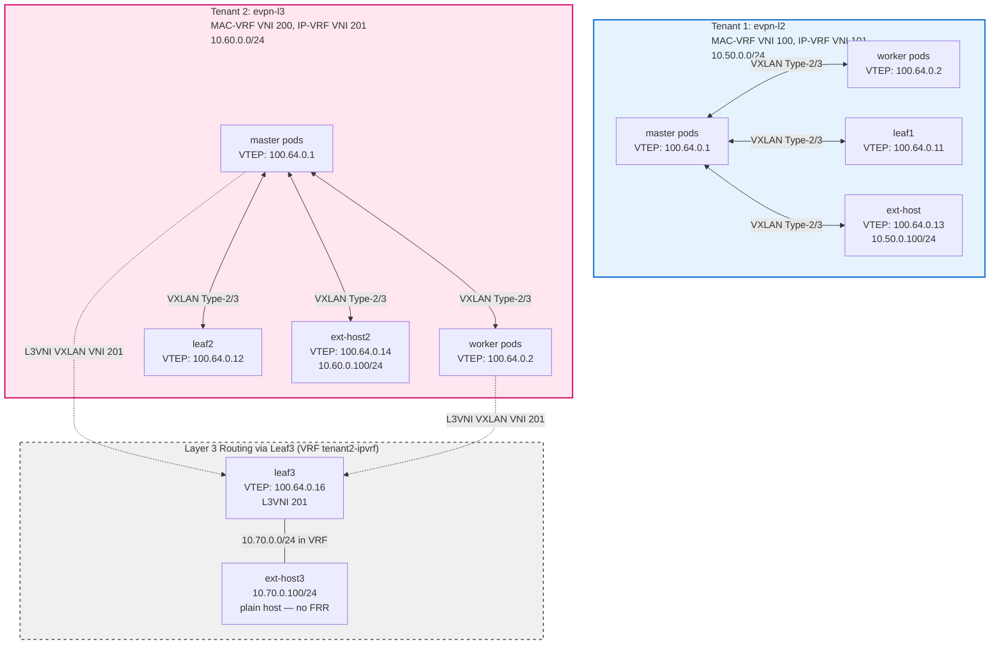

# BGP-EVPN

CLOS-style spine/leaf topology with BGP-EVPN. Demonstrates multi-tenant Layer 2 and Layer 3 ClusterUserDefinedNetworks (CUDNs) with EVPN transport, where pods and external hosts share broadcast domains over VXLAN or are routed via EVPN Type-5 routes.

## Overview

This lab extends the BGP CLOS fabric (lab 02) with EVPN (Ethernet VPN) support. Two tenants demonstrate different EVPN capabilities:

- **Tenant 1 (evpn-l2)**: Layer 2 CUDN with MAC-VRF (VNI 100) and IP-VRF (VNI 101). Pods and ext-host share a flat L2 broadcast domain (10.50.0.0/24).
- **Tenant 2 (evpn-l3)**: Layer 2 CUDN with MAC-VRF (VNI 200) and IP-VRF (VNI 201). Demonstrates both L2 connectivity (pods ↔ ext-host2 via VNI 200) and L3 routing (pods ↔ ext-host3 via EVPN Type-5 routes advertised by leaf3).

### Topology

#### Underlay: CLOS Fabric (IPv4 Unicast BGP)



The underlay provides IPv4 reachability between all BGP speakers using their loopback addresses. All devices run iBGP (AS 65000). Leaves act as route reflectors for cluster nodes and external hosts. Spine1 acts as a route reflector for leaves in the L2VPN EVPN address-family. This fabric carries VXLAN-encapsulated EVPN traffic between VTEPs.

#### Overlay: EVPN Multi-Tenant Networks



**Tenant 1 (evpn-l2)**:
- MAC-VRF (VNI 100): Layer 2 VXLAN tunnels between master, worker, leaf1, and ext-host
- IP-VRF (VNI 101): Layer 3 routing domain
- Type-2 (MAC/IP) and Type-3 (IMET) routes distribute MAC addresses and BUM handling

**Tenant 2 (evpn-l3)**:
- MAC-VRF (VNI 200): Layer 2 VXLAN tunnels between master, worker, leaf2, and ext-host2
- IP-VRF (VNI 201): Layer 3 routing domain
- Type-5 routes: leaf3 advertises ext-host3's 10.70.0.0/24 subnet to cluster nodes via EVPN (rd 192.168.255.16:201, rt 65000:201)

**Route Reflection**:
- Leaves are route reflectors for cluster nodes and external hosts (IPv4 + L2VPN EVPN)
- Spine1 is a route reflector for leaves and cluster nodes (L2VPN EVPN only)

### Addressing

| Segment | Subnet/IP | Notes |
|---------|-----------|-------|
| **Underlay P2P Links** | | |
| Spine1–Leaf1 P2P | 10.10.1.0/31 | Spine1 eth1, Leaf1 eth1 |
| Spine1–Leaf2 P2P | 10.10.2.0/31 | Spine1 eth2, Leaf2 eth1 |
| Spine1–Leaf3 core | 10.10.3.0/31 | Spine1 eth3, Leaf3 eth1 |
| Leaf3–ext-host3 | 10.70.0.0/24 | Leaf3 eth2 in VRF (10.70.0.1/24), ext-host3 eth1 (10.70.0.100/24) |
| Leaf1–master P2P | 10.0.1.0/31 | Leaf1 eth2, master ens4 |
| Leaf1–worker P2P | 10.0.1.2/31 | Leaf1 eth3, worker ens4 |
| Leaf1–ext-host P2P | 10.0.3.0/31 | Leaf1 eth4, ext-host eth1 |
| Leaf2–master P2P | 10.0.2.0/31 | Leaf2 eth2, master ens5 |
| Leaf2–worker P2P | 10.0.2.2/31 | Leaf2 eth3, worker ens5 |
| Leaf2–ext-host2 P2P | 10.0.4.0/31 | Leaf2 eth4, ext-host2 eth1 |
| **BGP Loopbacks** | | |
| Spine1 | 192.168.255.10/32 | BGP router-id |
| Leaf1 | 192.168.255.11/32 | BGP router-id |
| Leaf2 | 192.168.255.12/32 | BGP router-id |
| master | 192.168.255.1/32 | BGP router-id |
| worker | 192.168.255.2/32 | BGP router-id |
| ext-host | 192.168.255.13/32 | BGP router-id |
| ext-host2 | 192.168.255.14/32 | BGP router-id |
| Leaf3 | 192.168.255.16/32 | BGP router-id |
| **VTEP IPs** | | |
| master VTEP | 100.64.0.1/32 | Auto-assigned by VTEP resource |
| worker VTEP | 100.64.0.2/32 | Auto-assigned by VTEP resource |
| Leaf1 VTEP | 100.64.0.11/32 | Manual loopback (lo-vtep) |
| Leaf2 VTEP | 100.64.0.12/32 | Manual loopback (lo-vtep) |
| ext-host VTEP | 100.64.0.13/32 | Manual loopback (lo-vtep) |
| ext-host2 VTEP | 100.64.0.14/32 | Manual loopback (lo-vtep) |
| Leaf3 VTEP | 100.64.0.16/32 | Manual loopback (lo-vtep) |
| **Tenant 1 (evpn-l2)** | | |
| L2 CUDN subnet | 10.50.0.0/24 | Pod IPAM, namespace: evpn-demo |
| MAC-VRF VNI | 100 | VXLAN VNI for L2 overlay |
| IP-VRF VNI | 101 | L3 routing VRF |
| Route Targets | 65000:100, 65000:101 | Auto-derived (ASN:VNI) |
| ext-host SVI IP | 10.50.0.100/24 | Static IP on br-evpn bridge |
| **Tenant 2 (evpn-l3)** | | |
| L2 CUDN subnet | 10.60.0.0/24 | Pod IPAM, namespace: evpn-l3 |
| MAC-VRF VNI | 200 | VXLAN VNI for L2 overlay |
| IP-VRF VNI | 201 | L3 routing VRF |
| Route Targets | 65000:200, 65000:201 | Auto-derived (ASN:VNI) |
| ext-host2 SVI IP | 10.60.0.100/24 | Static IP on br-evpn bridge |
| ext-host3 subnet | 10.70.0.0/24 | L3-only, advertised via Type-5 |

### BGP Configuration

All devices use **AS 65000 (iBGP)**. Route reflection prevents iBGP split-horizon issues.

| Speaker | IPv4 Unicast Peers | L2VPN EVPN Peers | Role |
|---------|-------------------|------------------|------|
| **Spine1** | Leaf1 (10.10.1.1), Leaf2 (10.10.2.1), Leaf3 (192.168.255.16) | Leaf1 (192.168.255.11), Leaf2 (192.168.255.12), Leaf3 (192.168.255.16), master (192.168.255.1), worker (192.168.255.2) | Route reflector (EVPN) |
| **Leaf3** | Spine1 (10.10.3.0) | Spine1 (192.168.255.10) | VRF tenant2-ipvrf, L3VNI 201, generates Type-5 for 10.70.0.0/24 |
| **Leaf1** | Spine1 (10.10.1.0), master (192.168.255.1), worker (192.168.255.2), ext-host (192.168.255.13), Leaf2 (192.168.255.11) | Spine1 (192.168.255.10), master (192.168.255.1), worker (192.168.255.2), ext-host (192.168.255.13), ext-host2 (192.168.255.14), Leaf2 (192.168.255.12) | Route reflector (IPv4 + EVPN for clients) |
| **Leaf2** | Spine1 (10.10.2.0), master (192.168.255.1), worker (192.168.255.2), ext-host2 (192.168.255.14), Leaf1 (192.168.255.12) | Spine1 (192.168.255.10), master (192.168.255.1), worker (192.168.255.2), ext-host (192.168.255.13), ext-host2 (192.168.255.14), Leaf1 (192.168.255.11) | Route reflector (IPv4 + EVPN for clients) |
| **master** | Leaf1 (192.168.255.11), Leaf2 (192.168.255.12) | Leaf1 (192.168.255.11), Leaf2 (192.168.255.12), Spine1 (192.168.255.10) | Route reflector client |
| **worker** | Leaf1 (192.168.255.11), Leaf2 (192.168.255.12) | Leaf1 (192.168.255.11), Leaf2 (192.168.255.12), Spine1 (192.168.255.10) | Route reflector client |
| **ext-host** | Leaf1 (192.168.255.11), Leaf2 (192.168.255.12) | Leaf1 (192.168.255.11), Leaf2 (192.168.255.12) | Route reflector client (Tenant 1) |
| **ext-host2** | Leaf2 (192.168.255.12) | Leaf1 (192.168.255.11), Leaf2 (192.168.255.12) | Route reflector client (Tenant 2) |
| **ext-host3** | — | — | Plain host (no FRR), 10.70.0.100/24, gw=10.70.0.1 (leaf3 VRF) |

**Route Reflection Architecture**:
- **Spine1**: Route reflector for leaves and cluster nodes in L2VPN EVPN address-family
- **Leaves**: Route reflectors for cluster nodes and external hosts in both IPv4 unicast and L2VPN EVPN address-families
- **Leaf3**: Dedicated leaf for ext-host3; holds VRF `tenant2-ipvrf` (L3VNI 201) and generates the EVPN Type-5 for `10.70.0.0/24` via `redistribute connected`
- **Why route reflection**: iBGP split-horizon rule prevents routes learned from one iBGP peer from being advertised to another. Without route reflection, cluster nodes cannot learn VTEP IPs from each other or from external hosts.

### EVPN Details

**Tenant 1 (evpn-l2)**:
- **MAC-VRF**: VNI 100, Route Target 65000:100
- **IP-VRF**: VNI 101, Route Target 65000:101
- **Route Types**: Type-2 (MAC/IP), Type-3 (IMET)
- **VTEPs**: master (100.64.0.1), worker (100.64.0.2), leaf1 (100.64.0.11), ext-host (100.64.0.13)
- **VXLAN**: nolearning (MAC learning via BGP EVPN only)

**Tenant 2 (evpn-l3)**:
- **MAC-VRF**: VNI 200, Route Target 65000:200
- **IP-VRF**: VNI 201, Route Target 65000:201
- **Route Types**: Type-2 (MAC/IP), Type-3 (IMET), Type-5 (IP Prefix via spine1)
- **VTEPs**: master (100.64.0.1), worker (100.64.0.2), leaf2 (100.64.0.12), ext-host2 (100.64.0.14)
- **Layer 3 Routing**: spine1 advertises ext-host3's 10.70.0.0/24 as Type-5 EVPN routes
- **VXLAN**: nolearning (MAC learning via BGP EVPN only)

**Common**:
- **Transport**: VXLAN over BGP underlay (VTEP IPs routable via IPv4 unicast)
- **BFD**: Enabled on all BGP sessions for fast failure detection

---

## Day 1: Deploy

### 1. Deploy the cluster and containerlab topology

From the `labs/04-bgp-evpn` directory:

=== "Kubernetes"

    ```bash
    ./lab.sh up
    ```

=== "OpenShift"

    ```bash
    CLUSTER_TYPE=openshift ./lab.sh up
    ```

The script will:

- Create the `br-leaf1` and `br-leaf2` bridges
- Deploy the containerlab topology:
  - **spine1**: Route reflector for EVPN, connects to leaf1, leaf2, and ext-host3
  - **leaf1**: Route reflector for cluster nodes and external hosts, connects to master, worker, and ext-host
  - **leaf2**: Route reflector for cluster nodes and external hosts, connects to master, worker, and ext-host2
  - **ext-host**: Tenant 1 Layer 2 endpoint (VNI 100)
  - **ext-host2**: Tenant 2 Layer 2 endpoint (VNI 200)
  - **ext-host3**: Tenant 2 Layer 3 endpoint (10.70.0.0/24, advertised via Type-5 routes)
- Provision a 2-node cluster via kcli (1 control plane + 1 worker)

Set your kubeconfig:

```bash
export KUBECONFIG=$HOME/.kcli/clusters/bgp-evpn/auth/kubeconfig
```

### 2. Install platform components

Install in order. Use the tab matching your cluster type.

--8<-- "install-ovn-kubernetes.md"

#### Enable network features

=== "Kubernetes"

    These features were configured at OVN-Kubernetes install time. Nothing to
    do here.

=== "OpenShift"

    Patch the Cluster Network Operator to enable FRR, `routingViaHost`,
    `ipForwarding`, and `routeAdvertisements`:

    ```bash
    kubectl patch network.operator.openshift.io cluster --type=merge \
      --patch '{
        "spec": {
          "defaultNetwork": {
            "ovnKubernetesConfig": {
              "routingViaHost": true,
              "ipForwarding": "Always",
              "routeAdvertisements": "Enabled"
            }
          },
          "additionalNetworks": [],
          "useMultiNetworkPolicy": true
        }
      }'
    ```

    Wait for the cluster network operator to roll out:

    ```bash
    kubectl rollout status daemonset -n openshift-ovn-kubernetes ovnkube-node --timeout=600s
    ```

--8<-- "install-nmstate.md"

#### Install MetalLB / FRR-K8s

=== "Kubernetes"

    Install MetalLB with FRR-K8s mode via Helm:

    ```bash
    helm repo add metallb https://metallb.github.io/metallb
    helm repo update
    kubectl create namespace metallb-system || true
    helm install metallb metallb/metallb -n metallb-system \
      --set frrk8s.enabled=true
    kubectl rollout status deployment -n metallb-system metallb-controller --timeout=300s
    ```

---

## Day 2: Configure & Validate

### Apply networking configuration

Use `kubectl` (or `oc` on OpenShift).

#### 1. Apply the VTEP resource

The VTEP resource defines the VXLAN Tunnel Endpoint IP range. OVN-Kubernetes allocates VTEP IPs to cluster nodes from this range.

```bash
kubectl apply -f config/00-vtep.yaml
```

Verify VTEP status:

```bash
kubectl get vtep
```

Expected: `ACCEPTED=True, REASON=Allocated`

#### 2. Apply the NNCPs (loopback + P2P /31 + static routes)

The NNCP adds a BGP loopback (`lo-bgp`), P2P addresses on ens4/ens5, and static routes to the leaf loopbacks.

!!! warning "Apply NNCPs before FRRConfiguration"
    The static routes to the leaf loopbacks must exist on the nodes before
    FRR-K8s tries to peer. Apply the NNCPs first and wait for enactments to
    become `Available`.

```bash
kubectl apply -f config/01-nncps.yaml
```

Watch for all enactments to become `Available`:

```bash
kubectl get nnce -w
```

#### 3. Apply the FRRConfiguration

This configures BGP to the **leaf loopbacks** with iBGP (AS 65000), ebgpMultiHop, and BFD. Multi-protocol BGP is enabled (no `disableMP`) to support L2VPN EVPN address-family.

!!! important "Critical FRRConfiguration Pattern"
    The FRRConfiguration MUST include:
    
    - **VTEP IPs in `prefixes`**: The VTEP IP (e.g., 100.64.0.1/32) must be listed in the `prefixes` field
    - **`toAdvertise.allowed.mode: all`**: Required to advertise VTEP IPs to BGP neighbors
    - **`toReceive.allowed.mode: all`**: Required to receive VTEP IPs from BGP neighbors without inbound filters blocking them
    - **NO rawConfig for EVPN**: The EVPN configuration is auto-generated by RouteAdvertisements. Do not add EVPN rawConfig.
    
    Example structure:
    ```yaml
    spec:
      bgp:
        routers:
          - asn: 65000
            id: 192.168.255.1
            prefixes:
              - 100.64.0.1/32  # VTEP IP must be here
            neighbors:
              - address: 192.168.255.11
                asn: 65000
                toAdvertise:
                  allowed:
                    mode: all  # Required
                toReceive:
                  allowed:
                    mode: all  # Required
    ```

!!! note "Namespace on vanilla Kubernetes"
    The manifest uses `namespace: openshift-frr-k8s`. On vanilla Kubernetes,
    change it to the namespace where FRR-K8s is installed (e.g. `metallb-system`)
    or create the FRRConfiguration in that namespace.

```bash
kubectl apply -f config/02-frrconfiguration.yaml
```

#### 4. Apply RouteAdvertisements

This enables advertisement of the EVPN CUDN (pods) to the leaves. The `networkSelector` matches CUDNs with label `evpn: enabled`.

!!! info "Auto-generated EVPN Configuration"
    RouteAdvertisements automatically generates the L2VPN EVPN address-family configuration in FRR. You do NOT need to add EVPN rawConfig to the FRRConfiguration. The RouteAdvertisements resource:
    
    - Activates L2VPN EVPN neighbor sessions
    - Configures `advertise-all-vni` for MAC-VRF routes
    - Sets up proper route targets based on VNI assignments
    - Enables Type-2 (MAC/IP) and Type-3 (IMET) route advertisement

```bash
kubectl apply -f config/03-route-advertisements.yaml
```

#### 5. Apply the EVPN CUDN

This creates the L2 ClusterUserDefinedNetwork with EVPN transport.

```bash
kubectl apply -f config/04-evpn-cudn.yaml
```

Check CUDN status:

```bash
kubectl get clusteruserdefinednetwork evpn-l2
```

Expected: Conditions show `Accepted=True`.

#### 6. Create namespace and deploy workloads

```bash
kubectl apply -f config/05-namespaces.yaml
kubectl apply -f config/06-workloads.yaml
```

Wait for pods to be running:

```bash
kubectl get pods -n evpn-demo -w
```

---

### Configure Tenant 2 (evpn-l3)

The second tenant demonstrates both Layer 2 (MAC-VRF) and Layer 3 (IP-VRF with Type-5 routes) EVPN capabilities.

#### 7. Apply the EVPN L3 CUDN

```bash
kubectl apply -f config/07-evpn-l3-cudn.yaml
```

Check CUDN status:

```bash
kubectl get clusteruserdefinednetwork evpn-l3
```

Expected: Conditions show `Accepted=True`.

#### 8. Apply RouteAdvertisements for Tenant 2

```bash
kubectl apply -f config/08-route-advertisements-l3.yaml
```

#### 9. Create namespace and deploy workloads

```bash
kubectl apply -f config/09-namespaces-l3.yaml
kubectl apply -f config/10-workloads-l3.yaml
```

Wait for pods to be running:

```bash
kubectl get pods -n evpn-l3 -w
```

---

### Validate

#### Phase 1: Underlay Validation

Verify BGP IPv4 unicast is operational.

##### Check Leaf1 BGP summary

```bash
docker exec clab-bgp-evpn-leaf1 vtysh -c "show bgp summary"
```

Expected IPv4 Unicast neighbors in **Established** state:
- Spine1 (10.10.1.0)
- master (192.168.255.1)
- worker (192.168.255.2)
- ext-host (192.168.255.13)
- Leaf2 (192.168.255.12)

##### Check Spine1 BGP sessions

```bash
docker exec clab-bgp-evpn-spine1 vtysh -c "show bgp summary"
```

Expected IPv4 Unicast neighbors in **Established** state:
- Leaf1 (10.10.1.1)
- Leaf2 (10.10.2.1)
- ext-host3 (10.10.3.1)

```bash
docker exec clab-bgp-evpn-spine1 vtysh -c "show bgp l2vpn evpn summary"
```

Expected L2VPN EVPN neighbors in **Established** state:
- Leaf1 (192.168.255.11)
- Leaf2 (192.168.255.12)
- master (192.168.255.1)
- worker (192.168.255.2)

##### Verify VTEP IP reachability

```bash
# Get ovnkube-node pod on master
OVNKUBE_POD=$(kubectl get pods -n openshift-ovn-kubernetes -l app=ovnkube-node --field-selector spec.nodeName=bgp-evpn-ctlplane-0.labs.ovn-k8s.local -o name | head -1)

# Ping ext-host VTEP from master
kubectl exec -ti -n openshift-ovn-kubernetes "$OVNKUBE_POD" -c ovnkube-node -- ping -c 3 100.64.0.13
```

Expected: 0% packet loss.

##### Check BFD sessions

```bash
docker exec clab-bgp-evpn-leaf1 vtysh -c "show bfd peers"
```

Expected: All peers in **up** state.

#### Phase 2: EVPN Control Plane Validation

Verify EVPN sessions and routes are exchanged.

##### Check EVPN neighbor summary

```bash
docker exec clab-bgp-evpn-leaf1 vtysh -c "show bgp l2vpn evpn summary"
```

Expected L2VPN EVPN neighbors in **Established** with **PfxRcd > 0**:
- Spine1 (192.168.255.10) - route reflector
- master (192.168.255.1) - route reflector client
- worker (192.168.255.2) - route reflector client
- Leaf2 (192.168.255.12) - peer
- ext-host (192.168.255.13) - route reflector client
- ext-host2 (192.168.255.14) - route reflector client

##### Verify Type-3 IMET routes (multicast)

```bash
docker exec clab-bgp-evpn-ext-host vtysh -c "show bgp l2vpn evpn route type multicast"
```

Expected: IMET routes for VNI 100 from:
- master VTEP (100.64.0.1)
- worker VTEP (100.64.0.2)
- leaf1 VTEP (100.64.0.11)

##### Check VNI status

```bash
docker exec clab-bgp-evpn-ext-host vtysh -c "show evpn vni"
```

Expected: VNI 100, Type L2, # MACs, # Remote VTEPs (should show cluster nodes and leaf1).

#### Phase 3: L2 Connectivity Validation

Verify pods and ext-host are on the same L2 network.

##### Get pod IPs

```bash
# Use network-status annotation to get the UDN primary IP (not the default network)
POD_MASTER_IP=$(kubectl get pod -n evpn-demo evpn-pod-master \
  -o jsonpath='{.metadata.annotations.k8s\.v1\.cni\.cncf\.io/network-status}' \
  | jq -r '.[] | select(.default == true) | .ips[0]')

POD_WORKER_IP=$(kubectl get pod -n evpn-demo evpn-pod-worker \
  -o jsonpath='{.metadata.annotations.k8s\.v1\.cni\.cncf\.io/network-status}' \
  | jq -r '.[] | select(.default == true) | .ips[0]')

echo "Master pod IP: $POD_MASTER_IP"
echo "Worker pod IP: $POD_WORKER_IP"
```

##### Ping from ext-host to pods

```bash
docker exec clab-bgp-evpn-ext-host ping -c 3 $POD_MASTER_IP
docker exec clab-bgp-evpn-ext-host ping -c 3 $POD_WORKER_IP
```

Expected: 0% packet loss both.

##### Ping from pod to ext-host

```bash
kubectl exec -n evpn-demo evpn-pod-master -- ping -c 3 10.50.0.100
```

Expected: 0% packet loss.

##### Check MAC learning via EVPN

```bash
docker exec clab-bgp-evpn-ext-host vtysh -c "show evpn mac vni 100"
```

Expected:
- Local MAC (ext-host SVI MAC address)
- Remote MACs (pod MACs) with VTEP IPs (100.64.0.1, 100.64.0.2)

##### Verify VXLAN FDB entries

```bash
docker exec clab-bgp-evpn-ext-host bridge fdb show dev vxlan100
```

Expected: FDB entries with `dst <VTEP-IP>` for pod MACs.

##### Cross-node pod connectivity

```bash
kubectl exec -n evpn-demo evpn-pod-master -- ping -c 3 $POD_WORKER_IP
```

Expected: 0% packet loss (VXLAN tunnel between master VTEP 100.64.0.1 and worker VTEP 100.64.0.2).

#### Phase 4: EVPN Route Inspection

Deep dive into EVPN routes.

##### Type-2 MAC/IP routes

```bash
docker exec clab-bgp-evpn-leaf1 vtysh -c "show bgp l2vpn evpn route type macip"
```

Expected: Pod MACs with IPs, ext-host SVI MAC with IP 10.50.0.100, route target 65000:100.

##### Check route distinguisher (RD)

```bash
docker exec clab-bgp-evpn-ext-host vtysh -c "show bgp l2vpn evpn route rd 100.64.0.1:2"
```

Expected: Routes from master VTEP (RD format: VTEP-IP:VNI).

##### OVN-K8s EVPN state

```bash
kubectl exec -ti -n openshift-ovn-kubernetes "$OVNKUBE_POD" -c ovnkube-node -- \
  ovs-vsctl show | grep -A5 vxlan
```

Expected: VXLAN interface with `options:{remote_ip=flow}` (dynamic learning from FRR).

#### Phase 5: Tenant 2 L2 Connectivity (VNI 200)

Verify tenant 2 pods and ext-host2 share a L2 network.

##### Get tenant 2 pod IPs

```bash
# Use network-status annotation to get the UDN primary IP (not the default network)
POD_T2_MASTER_IP=$(kubectl get pod -n evpn-l3 evpn-pod-master \
  -o jsonpath='{.metadata.annotations.k8s\.v1\.cni\.cncf\.io/network-status}' \
  | jq -r '.[] | select(.default == true) | .ips[0]')

POD_T2_WORKER_IP=$(kubectl get pod -n evpn-l3 evpn-pod-worker \
  -o jsonpath='{.metadata.annotations.k8s\.v1\.cni\.cncf\.io/network-status}' \
  | jq -r '.[] | select(.default == true) | .ips[0]')

echo "Tenant 2 Master pod IP: $POD_T2_MASTER_IP"
echo "Tenant 2 Worker pod IP: $POD_T2_WORKER_IP"
```

##### Check ext-host2 EVPN sessions

```bash
docker exec clab-bgp-evpn-ext-host2 vtysh -c "show bgp l2vpn evpn summary"
```

Expected: Leaf1 (192.168.255.11), Leaf2 (192.168.255.12) in **Established** with **PfxRcd > 0**.

##### Verify VNI 200 status

```bash
docker exec clab-bgp-evpn-ext-host2 vtysh -c "show evpn vni"
```

Expected: VNI 200, Type L2, # MACs, # Remote VTEPs.

##### Ping from ext-host2 to tenant 2 pods

```bash
docker exec clab-bgp-evpn-ext-host2 ping -c 3 $POD_T2_MASTER_IP
docker exec clab-bgp-evpn-ext-host2 ping -c 3 $POD_T2_WORKER_IP
```

Expected: 0% packet loss both.

##### Ping from tenant 2 pod to ext-host2

```bash
kubectl exec -n evpn-l3 evpn-pod-master -- ping -c 3 10.60.0.100
```

Expected: 0% packet loss.

##### Verify MAC learning for VNI 200

```bash
docker exec clab-bgp-evpn-ext-host2 vtysh -c "show evpn mac vni 200"
```

Expected: Pod MACs with VTEP IPs (100.64.0.1, 100.64.0.2).

#### Phase 6: Tenant 2 L3 Connectivity (Type-5 Routes)

Verify Layer 3 routing between tenant 2 pods and ext-host3 via EVPN Type-5 routes.
ext-host3 is a plain host (no FRR) connected to leaf3's VRF interface (10.70.0.1/24).
Leaf3 generates the Type-5 route for 10.70.0.0/24 via `redistribute connected`.

##### Verify leaf3 VRF has the connected route

```bash
docker exec clab-bgp-evpn-leaf3 vtysh -c "show ip route vrf tenant2-ipvrf"
```

Expected: `C>* 10.70.0.0/24 is directly connected, eth2`

##### Verify leaf3 advertises Type-5 route

```bash
docker exec clab-bgp-evpn-leaf3 vtysh -c "show bgp l2vpn evpn route type 5"
```

Expected: `[5]:[0]:[24]:[10.70.0.0]` with RT:65000:201 and VTEP 100.64.0.16.

##### Check Type-5 route on cluster nodes

```bash
FRR_POD=$(kubectl get pod -n openshift-frr-k8s -l app=frr-k8s \
  --field-selector spec.nodeName=bgp-evpn-worker-0.labs.ovn-k8s.local \
  -o jsonpath='{.items[0].metadata.name}')
kubectl exec -n openshift-frr-k8s $FRR_POD -c frr -- \
  vtysh -c "show ip route vrf evpn-l3 10.70.0.0/24"
```

Expected: `B>* 10.70.0.0/24 via 100.64.0.16, svl3-evpn-l3 onlink` (leaf3 VTEP).

##### Ping from tenant 2 pod to ext-host3

```bash
kubectl exec -n evpn-l3 evpn-pod-master -- ping -c 3 10.70.0.100
```

!!! note "Known OVN-K8s issue"
    ICMP echo reply is dropped by OVN's stateful ACL due to a CT zone asymmetry
    with `routingViaHost`. Use traceroute to verify the data plane is working:
    ```bash
    kubectl exec -n evpn-l3 evpn-pod-master -- traceroute -n -m 2 10.70.0.100
    ```
    Expected: hop 1 = `10.70.0.100` (ext-host3 responds to UDP probes).

#### Phase 7: Multi-Tenancy Isolation

Verify tenants are properly isolated from each other.

##### Verify tenant 1 cannot reach tenant 2 resources

```bash
# From tenant 1 pod, try to reach ext-host2 (should fail)
kubectl exec -n evpn-demo evpn-pod-master -- ping -c 3 -W 2 10.60.0.100
```

Expected: 100% packet loss or "Network unreachable" (tenants are isolated).

##### Verify separate VNI assignments

```bash
# ext-host should only see VNI 100
docker exec clab-bgp-evpn-ext-host vtysh -c "show evpn vni"

# ext-host2 should only see VNI 200
docker exec clab-bgp-evpn-ext-host2 vtysh -c "show evpn vni"
```

Expected: Each external host sees only its assigned VNI.

##### Verify separate route targets

```bash
docker exec clab-bgp-evpn-leaf1 vtysh -c "show bgp l2vpn evpn route type macip"
```

Expected: Tenant 1 routes with RT 65000:100, Tenant 2 routes with RT 65000:200.

---

## Demonstrations

### L2 Connectivity Test

1. **ARP between pod and ext-host**:
   ```bash
   # From pod, ARP for ext-host
   kubectl exec -n evpn-demo evpn-pod-master -- ip neigh show | grep 10.50.0.100
   
   # From ext-host, ARP for pod
   docker exec clab-bgp-evpn-ext-host ip neigh show | grep $POD_MASTER_IP
   ```
   
   Both should show resolved ARP entries (learned via EVPN Type-2 routes).

### BFD Failure Detection

Sessions run over loopbacks with BFD. To see BFD in action:

1. **Break a P2P link**:
   ```bash
   # Temporarily shut down ext-host eth1
   docker exec clab-bgp-evpn-ext-host ip link set eth1 down
   ```

2. **Check BGP and BFD**:
   ```bash
   docker exec clab-bgp-evpn-leaf1 vtysh -c "show bgp summary"
   docker exec clab-bgp-evpn-leaf1 vtysh -c "show bfd peers"
   ```
   
   Expected: ext-host session goes down quickly (BFD detects failure).

3. **Restore**:
   ```bash
   docker exec clab-bgp-evpn-ext-host ip link set eth1 up
   ```
   
   Expected: Session and BFD come back up.

### EVPN Route Types

Inspect different EVPN route types:

1. **Type-2 (MAC/IP Advertisement)**:
   ```bash
   docker exec clab-bgp-evpn-ext-host vtysh -c "show bgp l2vpn evpn route type macip"
   ```
   
   Shows pod MACs with IPs.

2. **Type-3 (IMET - Inclusive Multicast Ethernet Tag)**:
   ```bash
   docker exec clab-bgp-evpn-ext-host vtysh -c "show bgp l2vpn evpn route type multicast"
   ```
   
   Shows VTEP originator IPs for BUM (broadcast, unknown unicast, multicast) traffic.

3. **Type-5 (IP Prefix Advertisement)**:
   ```bash
   docker exec clab-bgp-evpn-spine1 vtysh -c "show bgp l2vpn evpn route type prefix"
   ```
   
   Shows IP prefix routes (ext-host3's 10.70.0.0/24) advertised via EVPN for Layer 3 routing.

### Multi-Tenant L2 and L3 Demonstration

This topology demonstrates both Layer 2 and Layer 3 EVPN capabilities across two tenants:

1. **Tenant 1 (VNI 100/101)**: Layer 2 connectivity between pods and ext-host
   ```bash
   # Verify L2 connectivity
   kubectl exec -n evpn-demo evpn-pod-master -- ping -c 3 10.50.0.100
   
   # Check EVPN MAC learning
   docker exec clab-bgp-evpn-ext-host vtysh -c "show evpn mac vni 100"
   ```

2. **Tenant 2 (VNI 200/201)**: Layer 2 to ext-host2, Layer 3 to ext-host3
   ```bash
   # L2 connectivity to ext-host2
   kubectl exec -n evpn-l3 evpn-pod-master -- ping -c 3 10.60.0.100
   
   # L3 connectivity to ext-host3 (via Type-5 routes; use traceroute — see Phase 6 note)
   kubectl exec -n evpn-l3 evpn-pod-master -- traceroute -n -m 2 10.70.0.100
   
   # Verify Type-5 route propagation
   docker exec clab-bgp-evpn-leaf3 vtysh -c "show bgp l2vpn evpn route type 5"
   ```

3. **Tenant isolation**:
   ```bash
   # Tenant 1 cannot reach Tenant 2 resources
   kubectl exec -n evpn-demo evpn-pod-master -- ping -c 3 -W 2 10.60.0.100
   # Should fail (isolated)
   
   # Tenant 2 cannot reach Tenant 1 resources
   kubectl exec -n evpn-l3 evpn-pod-master -- ping -c 3 -W 2 10.50.0.100
   # Should fail (isolated)
   ```

### Route Reflection in Action

Demonstrate how route reflection enables VTEP discovery:

1. **Check VTEP routes on cluster nodes**:
   ```bash
   FRR_POD=$(kubectl get pod -n openshift-frr-k8s -l component=frr-k8s \
     --field-selector spec.nodeName=bgp-evpn-worker-0.labs.ovn-k8s.local \
     -o jsonpath='{.items[0].metadata.name}')
   
   kubectl exec -n openshift-frr-k8s $FRR_POD -c frr -- \
     vtysh -c "show ip route 100.64.0.0/24 longer-prefixes"
   ```
   
   Expected: VTEP IPs from other cluster nodes and external hosts learned via iBGP from leaves (route reflectors).

2. **Verify route reflector client status**:
   ```bash
   docker exec clab-bgp-evpn-leaf1 vtysh -c "show bgp l2vpn evpn summary"
   ```
   
   Expected: Cluster nodes and external hosts listed as neighbors (clients).

3. **Check spine1 as EVPN route reflector**:
   ```bash
   docker exec clab-bgp-evpn-spine1 vtysh -c "show bgp l2vpn evpn summary"
   ```
   
   Expected: Leaves and cluster nodes as neighbors, acting as route reflector for EVPN routes.

---

## Teardown

From the `labs/04-bgp-evpn` directory:

=== "Kubernetes"

    ```bash
    ./lab.sh down
    ```

=== "OpenShift"

    ```bash
    CLUSTER_TYPE=openshift ./lab.sh down
    ```

This will destroy the containerlab topology, delete the kcli cluster, and remove the `br-leaf1` and `br-leaf2` bridges.
