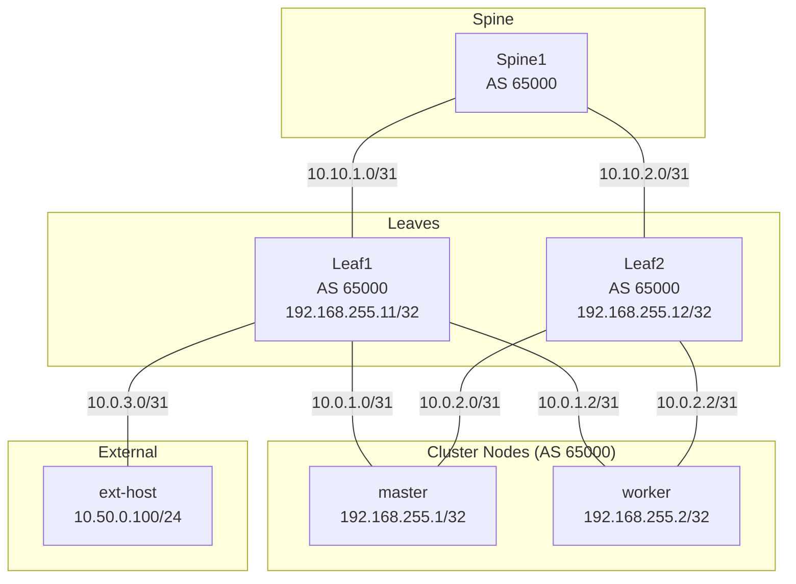
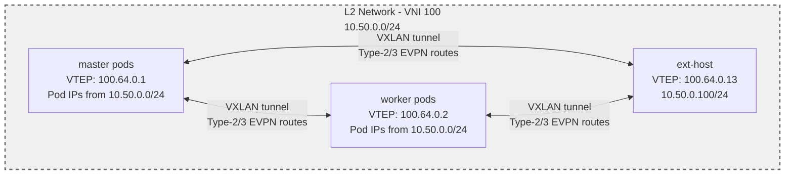

# BGP-EVPN

CLOS-style spine/leaf topology with BGP-EVPN. Demonstrates a L2 ClusterUserDefinedNetwork (CUDN) with EVPN transport, where pods and an external host share a flat L2 broadcast domain over VXLAN.

## Overview

This lab extends the BGP CLOS fabric (lab 02) with EVPN (Ethernet VPN) support. An L2 CUDN uses EVPN transport instead of GENEVE, distributing pod MAC/IP addresses via BGP L2VPN EVPN address-family. An external host (ext-host) participates in the EVPN fabric and can communicate with pods over the same L2 network.

### Topology

#### Underlay: CLOS Fabric (IPv4 Unicast BGP)



The underlay provides IPv4 reachability between all BGP speakers using their loopback
addresses. This fabric carries VXLAN-encapsulated EVPN traffic between VTEPs.

#### Overlay: EVPN L2 Network (10.50.0.0/24)



All endpoints share a flat L2 broadcast domain. MAC/IP addresses are distributed via
BGP EVPN (Type-2 routes), and BUM traffic is handled via EVPN IMET (Type-3 routes).
VXLAN tunnels connect the VTEPs over the underlay fabric.

### Addressing

| Segment | Subnet/IP | Notes |
|---------|-----------|-------|
| **Underlay (from lab 02)** | | |
| Spine1–Leaf1 P2P | 10.10.1.0/31 | eth1 on both |
| Spine1–Leaf2 P2P | 10.10.2.0/31 | eth2 on both |
| Leaf1–master P2P | 10.0.1.0/31 | Leaf1 eth2, master ens4 |
| Leaf1–worker P2P | 10.0.1.2/31 | Leaf1 eth3, worker ens4 |
| Leaf2–master P2P | 10.0.2.0/31 | Leaf2 eth2, master ens5 |
| Leaf2–worker P2P | 10.0.2.2/31 | Leaf2 eth3, worker ens5 |
| **NEW: Leaf1–ext-host P2P** | **10.0.3.0/31** | **Leaf1 eth4, ext-host eth1** |
| **Loopbacks** | | |
| master | 192.168.255.1/32 | BGP router-id |
| worker | 192.168.255.2/32 | BGP router-id |
| Leaf1 | 192.168.255.11/32 | BGP router-id |
| Leaf2 | 192.168.255.12/32 | BGP router-id |
| **ext-host** | **192.168.255.13/32** | **BGP router-id** |
| **VTEP IPs** | | |
| master VTEP | 100.64.0.1/32 | Auto-assigned by VTEP resource |
| worker VTEP | 100.64.0.2/32 | Auto-assigned by VTEP resource |
| **ext-host VTEP** | **100.64.0.13/32** | **Manual loopback, advertised via BGP** |
| **EVPN Overlay** | | |
| L2 CUDN subnet | 10.50.0.0/24 | Pod IPAM, flat L2 network |
| EVPN VNI | 100 | VXLAN VNI for MAC-VRF |
| Route Target | 65000:100 | Auto-derived (ASN:VNI) |
| ext-host SVI IP | 10.50.0.100/24 | Static IP on br-evpn bridge |

### BGP Configuration

| Speaker | ASN | IPv4 Unicast Peers | L2VPN EVPN Peers |
|---------|-----|-------------------|------------------|
| Spine1 | 65413 | Leaf1 10.10.1.1, Leaf2 10.10.2.1 | None (underlay only) |
| Leaf1 | 65001 | Spine1 10.10.1.0, Leaf2 192.168.255.12, ext-host 192.168.255.13, master 192.168.255.1, worker 192.168.255.2 | Leaf2, ext-host, master, worker |
| Leaf2 | 65002 | Spine1 10.10.2.0, Leaf1 192.168.255.11, ext-host 192.168.255.13, master 192.168.255.1, worker 192.168.255.2 | Leaf1, ext-host, master, worker |
| ext-host | 65003 | Leaf1 192.168.255.11, Leaf2 192.168.255.12 | Leaf1, Leaf2 |
| Cluster | 65000 | Leaf1 192.168.255.11, Leaf2 192.168.255.12 | Leaf1, Leaf2 |

**EVPN Full Mesh**: All EVPN speakers peer directly. No route reflection.

### EVPN Details

- **MAC-VRF Only**: Type-2 (MAC/IP) and Type-3 (IMET) routes
- **VNI**: 100
- **Route Target**: 65000:100
- **VXLAN**: nolearning (MAC learning via BGP EVPN only)
- **Transport**: VXLAN over BGP underlay (VTEP IPs routable via IPv4 unicast)

---

## Day 1: Deploy

### 1. Deploy the cluster and containerlab topology

From the `labs/04-bgp-evpn` directory:

=== "Kubernetes"

    ```bash
    ./lab.sh up
    ```

=== "OpenShift"

    ```bash
    CLUSTER_TYPE=openshift ./lab.sh up
    ```

The script will:

- Create the `br-leaf1` and `br-leaf2` bridges
- Deploy the containerlab topology (spine1, leaf1, leaf2, ext-host)
- Provision a 2-node cluster via kcli (1 control plane + 1 worker)

Set your kubeconfig:

```bash
export KUBECONFIG=$HOME/.kcli/clusters/bgp-evpn/auth/kubeconfig
```

### 2. Install platform components

Install in order. Use the tab matching your cluster type.

--8<-- "install-ovn-kubernetes.md"

#### Enable network features

=== "Kubernetes"

    These features were configured at OVN-Kubernetes install time. Nothing to
    do here.

=== "OpenShift"

    Patch the Cluster Network Operator to enable FRR, `routingViaHost`,
    `ipForwarding`, and `routeAdvertisements`:

    ```bash
    kubectl patch network.operator.openshift.io cluster --type=merge \
      --patch '{
        "spec": {
          "defaultNetwork": {
            "ovnKubernetesConfig": {
              "routingViaHost": true,
              "ipForwarding": "Always",
              "routeAdvertisements": "Enabled"
            }
          },
          "additionalNetworks": [],
          "useMultiNetworkPolicy": true
        }
      }'
    ```

    Wait for the cluster network operator to roll out:

    ```bash
    kubectl rollout status daemonset -n openshift-ovn-kubernetes ovnkube-node --timeout=600s
    ```

--8<-- "install-nmstate.md"

#### Install MetalLB / FRR-K8s

=== "Kubernetes"

    Install MetalLB with FRR-K8s mode via Helm:

    ```bash
    helm repo add metallb https://metallb.github.io/metallb
    helm repo update
    kubectl create namespace metallb-system || true
    helm install metallb metallb/metallb -n metallb-system \
      --set frrk8s.enabled=true
    kubectl rollout status deployment -n metallb-system metallb-controller --timeout=300s
    ```

---

## Day 2: Configure & Validate

### Apply networking configuration

Use `kubectl` (or `oc` on OpenShift).

#### 1. Apply the VTEP resource

The VTEP resource defines the VXLAN Tunnel Endpoint IP range. OVN-Kubernetes allocates VTEP IPs to cluster nodes from this range.

```bash
kubectl apply -f config/00-vtep.yaml
```

Verify VTEP status:

```bash
kubectl get vtep
```

Expected: `ACCEPTED=True, REASON=Allocated`

#### 2. Apply the NNCPs (loopback + P2P /31 + static routes)

The NNCP adds a BGP loopback (`lo-bgp`), P2P addresses on ens4/ens5, and static routes to the leaf loopbacks.

!!! warning "Apply NNCPs before FRRConfiguration"
    The static routes to the leaf loopbacks must exist on the nodes before
    FRR-K8s tries to peer. Apply the NNCPs first and wait for enactments to
    become `Available`.

```bash
kubectl apply -f config/01-nncps.yaml
```

Watch for all enactments to become `Available`:

```bash
kubectl get nnce -w
```

#### 3. Apply the FRRConfiguration

This configures BGP to the **leaf loopbacks** with ebgpMultiHop and BFD. Multi-protocol BGP is enabled (no `disableMP`) to support L2VPN EVPN address-family.

!!! note "Namespace on vanilla Kubernetes"
    The manifest uses `namespace: openshift-frr-k8s`. On vanilla Kubernetes,
    change it to the namespace where FRR-K8s is installed (e.g. `metallb-system`)
    or create the FRRConfiguration in that namespace.

```bash
kubectl apply -f config/02-frrconfiguration.yaml
```

#### 4. Apply RouteAdvertisements

This enables advertisement of the EVPN CUDN (pods) to the leaves. The `networkSelector` matches CUDNs with label `evpn: enabled`.

```bash
kubectl apply -f config/03-route-advertisements.yaml
```

#### 5. Apply the EVPN CUDN

This creates the L2 ClusterUserDefinedNetwork with EVPN transport.

```bash
kubectl apply -f config/04-evpn-cudn.yaml
```

Check CUDN status:

```bash
kubectl get clusteruserdefinednetwork evpn-l2
```

Expected: Conditions show `Accepted=True`.

#### 6. Create namespace and deploy workloads

```bash
kubectl apply -f config/05-namespaces.yaml
kubectl apply -f config/06-workloads.yaml
```

Wait for pods to be running:

```bash
kubectl get pods -n evpn-demo -w
```

---

### Validate

#### Phase 1: Underlay Validation

Verify BGP IPv4 unicast is operational.

##### Check Leaf1 BGP summary

```bash
docker exec clab-bgp-evpn-leaf1 vtysh -c "show bgp summary"
```

Expected: Spine1 (10.10.1.0), master (192.168.255.1), worker (192.168.255.2), ext-host (192.168.255.13), Leaf2 (192.168.255.12) all in **Established** state.

##### Verify VTEP IP reachability

```bash
# Get ovnkube-node pod on master
OVNKUBE_POD=$(kubectl get pods -n openshift-ovn-kubernetes -l app=ovnkube-node --field-selector spec.nodeName=bgp-evpn-ctlplane-0.labs.ovn-k8s.local -o name | head -1)

# Ping ext-host VTEP from master
kubectl exec -ti -n openshift-ovn-kubernetes "$OVNKUBE_POD" -c ovnkube-node -- ping -c 3 100.64.0.13
```

Expected: 0% packet loss.

##### Check BFD sessions

```bash
docker exec clab-bgp-evpn-leaf1 vtysh -c "show bfd peers"
```

Expected: All peers in **up** state.

#### Phase 2: EVPN Control Plane Validation

Verify EVPN sessions and routes are exchanged.

##### Check EVPN neighbor summary

```bash
docker exec clab-bgp-evpn-leaf1 vtysh -c "show bgp l2vpn evpn summary"
```

Expected: master (192.168.255.1), worker (192.168.255.2), Leaf2 (192.168.255.12), ext-host (192.168.255.13) in **Established** with **PfxRcd > 0**.

##### Verify Type-3 IMET routes (multicast)

```bash
docker exec clab-bgp-evpn-ext-host vtysh -c "show bgp l2vpn evpn route type multicast"
```

Expected: IMET routes from master VTEP (100.64.0.1), worker VTEP (100.64.0.2).

##### Check VNI status

```bash
docker exec clab-bgp-evpn-ext-host vtysh -c "show evpn vni"
```

Expected: VNI 100, Type L2, # MACs, # Remote VTEPs (2 from cluster nodes).

#### Phase 3: L2 Connectivity Validation

Verify pods and ext-host are on the same L2 network.

##### Get pod IPs

```bash
POD_MASTER_IP=$(kubectl get pod -n evpn-demo evpn-pod-master \
  -o jsonpath='{.status.podIPs[0].ip}')

POD_WORKER_IP=$(kubectl get pod -n evpn-demo evpn-pod-worker \
  -o jsonpath='{.status.podIPs[0].ip}')

echo "Master pod IP: $POD_MASTER_IP"
echo "Worker pod IP: $POD_WORKER_IP"
```

##### Ping from ext-host to pods

```bash
docker exec clab-bgp-evpn-ext-host ping -c 3 $POD_MASTER_IP
docker exec clab-bgp-evpn-ext-host ping -c 3 $POD_WORKER_IP
```

Expected: 0% packet loss both.

##### Ping from pod to ext-host

```bash
kubectl exec -n evpn-demo evpn-pod-master -- ping -c 3 10.50.0.100
```

Expected: 0% packet loss.

##### Check MAC learning via EVPN

```bash
docker exec clab-bgp-evpn-ext-host vtysh -c "show evpn mac vni 100"
```

Expected:
- Local MAC (ext-host SVI MAC address)
- Remote MACs (pod MACs) with VTEP IPs (100.64.0.1, 100.64.0.2)

##### Verify VXLAN FDB entries

```bash
docker exec clab-bgp-evpn-ext-host bridge fdb show dev vxlan100
```

Expected: FDB entries with `dst <VTEP-IP>` for pod MACs.

##### Cross-node pod connectivity

```bash
kubectl exec -n evpn-demo evpn-pod-master -- ping -c 3 $POD_WORKER_IP
```

Expected: 0% packet loss (VXLAN tunnel between master VTEP 100.64.0.1 and worker VTEP 100.64.0.2).

#### Phase 4: EVPN Route Inspection

Deep dive into EVPN routes.

##### Type-2 MAC/IP routes

```bash
docker exec clab-bgp-evpn-leaf1 vtysh -c "show bgp l2vpn evpn route type macip"
```

Expected: Pod MACs with IPs, ext-host SVI MAC with IP 10.50.0.100, route target 65000:100.

##### Check route distinguisher (RD)

```bash
docker exec clab-bgp-evpn-ext-host vtysh -c "show bgp l2vpn evpn route rd 100.64.0.1:2"
```

Expected: Routes from master VTEP (RD format: VTEP-IP:VNI).

##### OVN-K8s EVPN state

```bash
kubectl exec -ti -n openshift-ovn-kubernetes "$OVNKUBE_POD" -c ovnkube-node -- \
  ovs-vsctl show | grep -A5 vxlan
```

Expected: VXLAN interface with `options:{remote_ip=flow}` (dynamic learning from FRR).

---

## Demonstrations

### L2 Connectivity Test

1. **ARP between pod and ext-host**:
   ```bash
   # From pod, ARP for ext-host
   kubectl exec -n evpn-demo evpn-pod-master -- ip neigh show | grep 10.50.0.100
   
   # From ext-host, ARP for pod
   docker exec clab-bgp-evpn-ext-host ip neigh show | grep $POD_MASTER_IP
   ```
   
   Both should show resolved ARP entries (learned via EVPN Type-2 routes).

### BFD Failure Detection

Sessions run over loopbacks with BFD. To see BFD in action:

1. **Break a P2P link**:
   ```bash
   # Temporarily shut down ext-host eth1
   docker exec clab-bgp-evpn-ext-host ip link set eth1 down
   ```

2. **Check BGP and BFD**:
   ```bash
   docker exec clab-bgp-evpn-leaf1 vtysh -c "show bgp summary"
   docker exec clab-bgp-evpn-leaf1 vtysh -c "show bfd peers"
   ```
   
   Expected: ext-host session goes down quickly (BFD detects failure).

3. **Restore**:
   ```bash
   docker exec clab-bgp-evpn-ext-host ip link set eth1 up
   ```
   
   Expected: Session and BFD come back up.

### EVPN Route Types

Inspect different EVPN route types:

1. **Type-2 (MAC/IP Advertisement)**:
   ```bash
   docker exec clab-bgp-evpn-ext-host vtysh -c "show bgp l2vpn evpn route type macip"
   ```
   
   Shows pod MACs with IPs.

2. **Type-3 (IMET - Inclusive Multicast Ethernet Tag)**:
   ```bash
   docker exec clab-bgp-evpn-ext-host vtysh -c "show bgp l2vpn evpn route type multicast"
   ```
   
   Shows VTEP originator IPs for BUM (broadcast, unknown unicast, multicast) traffic.

---

## Teardown

From the `labs/04-bgp-evpn` directory:

=== "Kubernetes"

    ```bash
    ./lab.sh down
    ```

=== "OpenShift"

    ```bash
    CLUSTER_TYPE=openshift ./lab.sh down
    ```

This will destroy the containerlab topology, delete the kcli cluster, and remove the `br-leaf1` and `br-leaf2` bridges.
